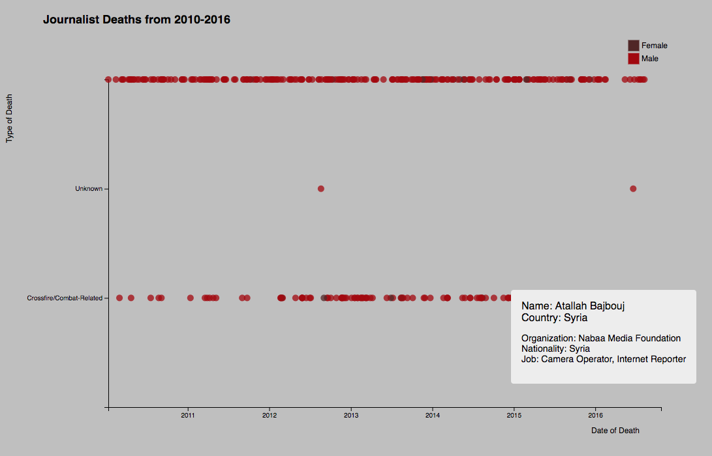
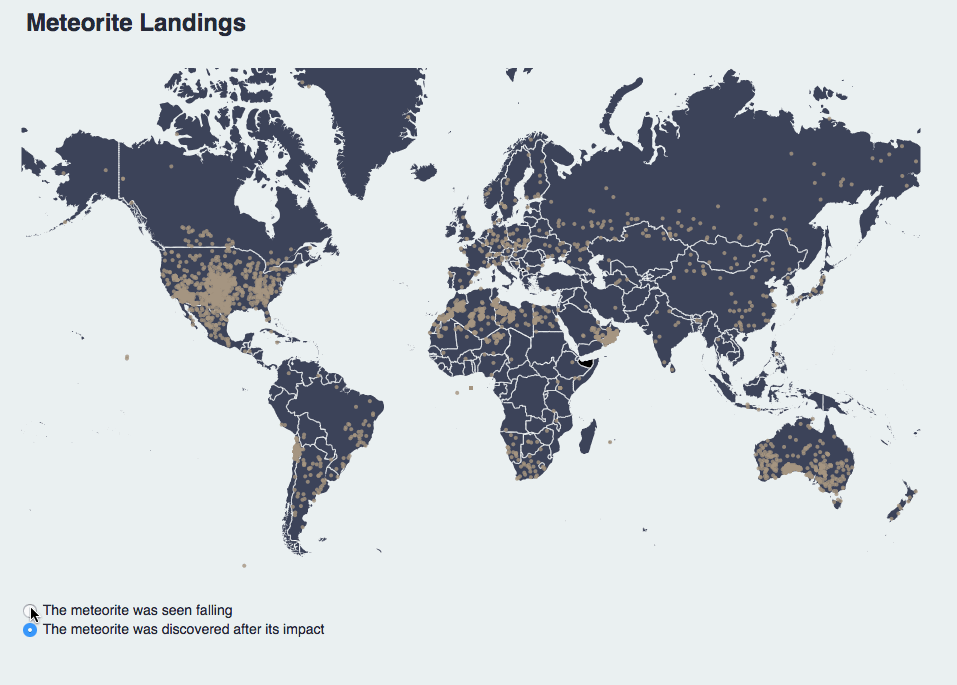
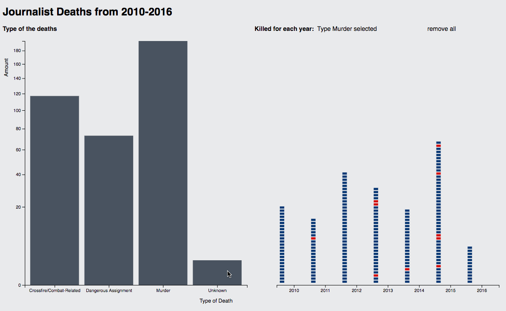

# Data Visualization with d3.js 
Data Visualization with D3.js course at University of Applied Sciences Potsdam (SS 2017) 

This is the repository for semester project for [Katja Dittrich’s](https://uclab.fh-potsdam.de/people/katja-dittrich/) [Information Visualization with d3js course](https://github.com/Letty/infovis-with-d3js) at University of Applied Sciences Potsdam (SS 2017). This course provided an introduction to data visualization with d3.js and consisted of 4 assignments. 

## The list of projects
[Simple Chart](https://github.com/kuzminadya/FHP-infovis-D3js/tree/master/exoplanets)

The assignment was to visualize [List of Exoplanets in the Conservative and Optimistic Habitable Zone](https://github.com/Letty/infovis-with-d3js/tree/master/assignments/datasets/exoplanets#list-of-exoplanets-in-the-conservative-and-optimistic-habitable-zone) dataset. 


[Chart with interaction](../journalists_kills)
The task was to visualize [Journalists Killed since 1992](https://www.kaggle.com/cpjournalists/journalists-killed-worldwide-since-1992) dataset with interactions, legends and scaling functions 



[Map](../map)

The next one was a visualization of [Meteorite Landings on Earth between 1900 and 2013](https://www.kaggle.com/nasa/meteorite-landings) dataset.

 

[Coordinated Views](../coordinated_views)

During the last one we could choose one of the previous dataset, but this time we had to to connect two visualizations with interaction. I choose dataset from the second assignment.

 

## Setup
1. Clone this repo 

2. Run the server

    python -m SimpleHTTPServer <portnumber>
    
    for pyhton 3: python -m http.server <portnumber>`` replace``` with a four digit number

3. Check your browser under localhost:<portnumber>
	
## License
This project is licensed under the terms of the MIT license.